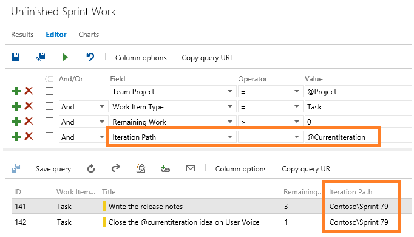
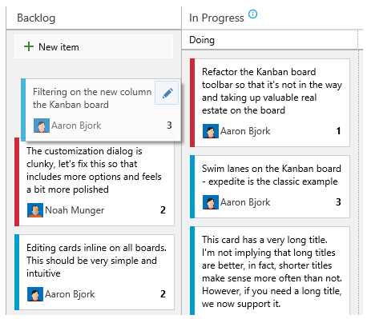
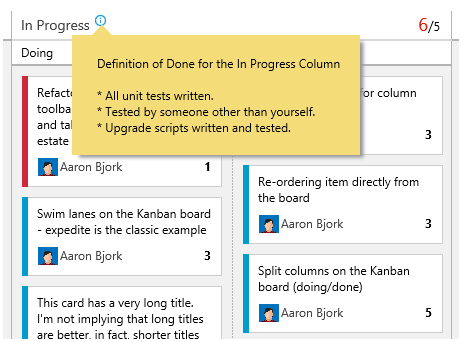
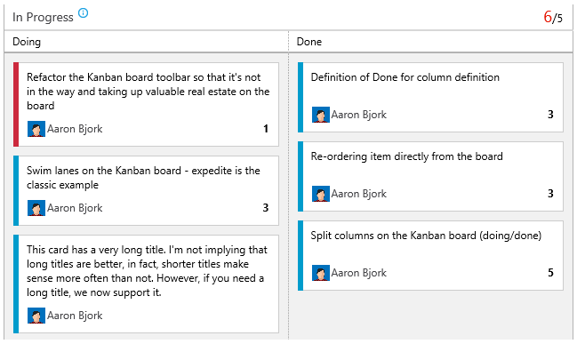
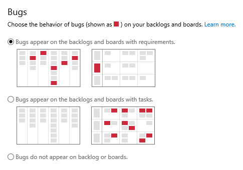

#@CurrentIteration query token, Kanban reordering and DoD – Mar 10

**Note:** The improvements discussed in this post will be rolling out throughout the week. Please follow progress of the deployment at [http://blogs.msdn.com/b/vsoservice/](http://blogs.msdn.com/b/vsoservice/).

##Current iteration query token

Let’s start with an item that’s been on our backlog for quite some time—the ability to specify a token that represents the current iteration in iteration-based queries. As you know, iterations have dates associated with them. As you move from iteration to iteration, it’s very tedious to update all the queries used to track work for the next iteration. Today’s update brings the addition of a new query token, @CurrentIteration, that returns the current iteration based on today’s date. The screenshot below shows how this would work in context of a query that tracks unfinished work in a sprint (iteration).

There are some limitations with this new token that I want to explain. First, it doesn’t work in Excel. I know… I’m sure many of you will chastise me for this. The token relies on understanding your team context, and unfortunately Excel doesn’t have all the information needed to determine which iteration is current. We’ll work on improving this going forward, but didn’t want it to hold up the token's seeing the light of day. Support for the new token will exist in VS 2015 and VS 2013 Update 5.

[User Voice #121579](https://visualstudio.uservoice.com/forums/121579-visual-studio/suggestions/2293180-creating-queries-token-for-current-iteration) has been marked as done!

##Reordering on the Kanban board

Let’s switch gears and talk about a few more updates to our Kanban boards. First, we’ve turned on reordering items on the board. You can now move items up and down in priority within each column on your board. Any changes made on the board are also reflected directly on the backlog. In fact, with this change many of you may choose to use the board over the backlog, as the board now supports adding, inline editing, and reordering.

##Kanban definition of done

As work moves through your board, it’s critical that you and your team are on the same page about what “done” means for each column. Today’s deployment brings a new capability that lets you specify a definition of done for each column on your board. Columns with a definition now include a small icon in the header that communicates the agreed-upon definition.

##Responsive card sizes

We made an adjustment to both the Kanban board and Taskboard to implement responsive auto-sizing based on the length of the title. Cards on the Kanban board now grow vertically in relation to the title, and horizontally in relation to your browser. Cards on the Taskboard grow horizontally, but we’ve chosen to leave cards on the Taskboard with a fixed size, given that most titles on Tasks are short. You can see in the screenshot below how the cards are wider than the sections above.

##Bugs on the Taskboard

Late last year we started work on a set of features designed to provide you with flexibility around how [bug work items show up on your backlogs](https://www.visualstudio.com/en-us/articles/news/2014/nov-04-team-services) and boards. Today’s deployment brings a new option that lets you choose to have bugs show up on your Taskboard just like tasks. In this mode, bugs that are children of requirements (stories, PBIs, etc.) are added to the Taskboard swim lane for the appropriate requirement.

Go to the admin section for your team to adjust this setting. Going forward, we’ll add even more flexibility here so that bugs can show in both places (on the backlog and as children of requirements).

##Syntax highlight for XML, Sass, Objective-C, R

The code editor in the web portal has been updated to support syntax highlighting for more languages and content types. The latest additions include Objective-C, R, Sass, and files containing XML content (even if the extension isn't .xml).

##CodeLens for accounts in West Europe

And our last bit of news is that [CodeLens](https://msdn.microsoft.com/en-us/library/dn269218.aspx) is now in Public Preview for Visual Studio Online accounts in the West Europe region. You will need Visual Studio Ultimate 2013 Update 4 or Visual Studio 2015 Preview or later and your code should be checked into Team Foundation Version Control in Visual Studio Online.

That’s it for Sprint 79. If you have questions about what we’ve shipped today, please reach out on Twitter ([@aaronbjork](https://twitter.com/aaronbjork)). And don’t forget to share what you’d like to see us prioritize on [UserVoice](http://visualstudio.uservoice.com/forums/330519-vso). See you again in three weeks.

Thanks,

Aaron Bjork