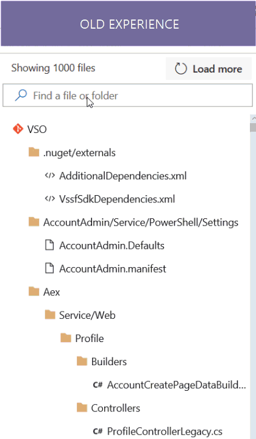
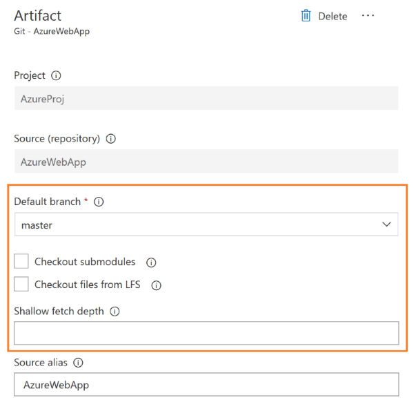
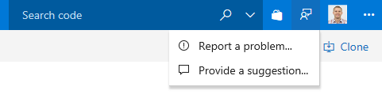

#  – VSTS Sprint 124 Update

In the **Sprint 124 Update** of Visual Studio Team Services (VSTS) we’re announcing the availability of multi-phase builds to build multiple kinds of apps as part of a single build. Read more about [Multi-phase builds](#multi-phase-builds) below.

Some of the other key feature highlights include:

* [New Queries experience](#new-queries-experience) - Use favorites and a simplified directory to get to the queries that are important to you.
* [Personalized notifications for releases](#personalized-notifications-for-releases) - Keep the release pipeline moving with automated notifications for interventions.
* [Run webtests using the VSTest task](#run-webtests-using-the-vstest-task) - Include webtests in your CI/CD pipeline.
* [Gulp, Yarn, and more authenticated feed support](#gulp-yarn-and-more-authenticated-feed-support) - Use authenticated feeds in subsequent build tasks.
* [Burndown and Burnup widgets](#burndown-and-burnup-widgets) - Answer the question: Will we complete this project on time?
* [Deep linking](#wiki-page-deep-linking), [preview content side-by-side](#preview-content-as-you-edit-wiki-pages), and [paste rich HTML content](#paste-rich-content-as-html) in Wiki.

> [!NOTE]
> The features discussed in this post will be rolling out over the next three weeks.

## Code

### Pull request comments follow renamed files

Sometimes files are renamed or moved while a PR is active.  Previously, if there were comments on those renamed files, the latest view of the code wouldn't be display the comments.  We've now improved the comment tracking feature to follow the renames, displaying comments as expected on the latest version of renamed or moved files.

### Reference work items in Wiki

While writing release notes or epics documents in Wiki, there is a need to link the pages to work items. Now you can simply press # and easily reference a work item in a Wiki page.

### Ctrl S to save Wiki page

Users often make multiple edits in a Wiki page and prefer to Save their changes as they continue to edit. Currently when users click on Save, a dialog appears where they need to enter a revision message and confirm the save. This makes editing the Wiki a slow and tedious task and involves multiple clicks.

Now you can simply press CTRL S to save a page and continue editing. If you really want to customize the revision message you can always do that by invoking the old revision message dialog by clicking on the drop down next to Save.

### Enhanced filter capability for commits with more than 1000 files changed

There are several commits and pull requests that have modified more than 1000 files in a commit. When users filter content in such commits, they first filter the content and then have to click on load more several times to see whether the file of their interest is in the commit.

We have improved this experience. Now, when users filter content in the tree view, we search for that file in entire commit instead of just looking at the top 1000 files loaded. We have also improved performance of the commit details page when there are more than 1000 files modified.

### New experience for code and work items search

The new Search experience for both Code and Work items is now available as a preview.  You can turn it on from the banner when you carry out your search. The new experience addresses many of the problems reported on the old experience and brings in a host of improvements as well:

* A new 2 pane layout liberating more space for results and code/work items, and better suited to for many more screens sizes
* New filtering controls designed to address all the problems reported with the old filters
* A navigation model to let you be in control of how broad you want to search
* Sort by filename and filepath in Code Search
* You can now filter by branch in Code Search
* Improved results layout for Work Item search optimized for scanning through them quickly

## Build

### Use Azure Key Vault secrets in your CI build

You can now leverage Azure's highly secure storage to manage the secrets you use in your build process.
Simply create a variable group that points to the key vault, and then use that variable group in your build definition.
See [Azure Key Vault](https://azure.microsoft.com/en-us/services/key-vault/) and [Link secrets from an Azure Key vault as variables](https://docs.microsoft.com/en-us/vsts/build-release/concepts/library/variable-groups).

### New software on our hosted agents

Software we've updated in the Hosted VS2017 pool includes: Visual Studio 2017 version 15.3.5, Azure Service Fabric SDK 2.7, and Docker version 17.10.0. See [VSTS Hosted VS2017 image](https://go.microsoft.com/fwlink/?linkid=859172).

## Release

### Bulk Deploy environments manually from release view

Users can now manually trigger a "deploy" action to multiple environments of a release at the same time. This allows users to select multiple environments in a release with failed configurations/deployments and re-deploy to all of the environments at one go.

### Work information in Release with Jenkins CI

We want to have better integration with popular CI systems like Jenkins. Today in release summary tab we show work items only if the CI build is coming from VSTS, with this feature we now show work information for Jenkins CI artifacts as well - provided Jenkins server is reachable by the VSTS/TFS agent that is executing the release.

### Azure Resource Group task - Expose deployment outputs as Task variables

Azure Resource Manager templates allow defining "outputs" which need to be returned after an Azure deployment.
We have now enhanced our inbuilt VSTS Azure RG deploy task to expose the "output" JSON section of the deployment object as task output parameter with name: `<Task Reference name>.DeploymentOutputs`.  Users can further parse the JSON object and access the individual output values which can be consumed in subsequent tasks of the release environment.

### Artifact properties should be editable and branch based on build definition property or variable group

You can now edit default properties of Git/GitHub artifact types after it has been saved. This will be particularly useful in scenarios where the branch for stable version of artifact has changed and future continuous delivery releases should use this branch to obtain newer versions of an artifact. The options for checkout(Eg.: checkout submodules) can also be changed.

## Feedback

We would love to hear what you think about these features. Report a problem or provide a suggestion if you have ideas on things you’d like to see us prioritize, through the feedback menu.

You can also get advice and your questions answers by the community on [Stack Overflow](https://stackoverflow.com/questions/tagged/vsts).

Thanks,

Jamie Cool