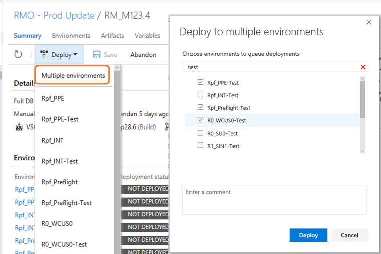
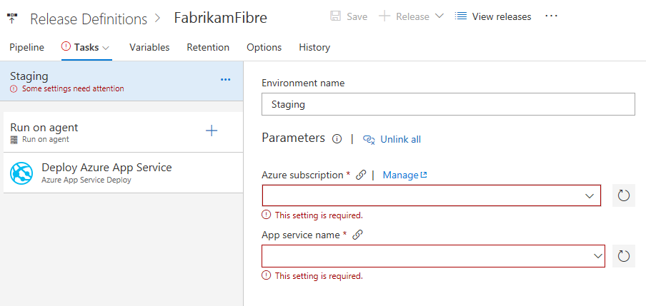

# Streamlined code and work items search – VSTS Sprint 124 Update

In the **Sprint 124 Update** of Visual Studio Team Services (VSTS) we’re announcing the availability of the combined, streamlined code and work items search in preview to help you find the code or work items you’re looking for even faster. Read more about [New experience for search](#new-experience-for-code-and-work-items-search) below.

Some of the other key feature highlights include:

* [New Queries experience](#new-queries-experience) - Use favorites and a simplified directory to get to the queries that are important to you.
* [Personalized notifications for releases](#personalized-notifications-for-releases) - Keep the release pipeline moving with automated notifications for interventions.
* [Run webtests using the VSTest task](#run-webtests-using-the-vstest-task) - Include webtests in your CI/CD pipeline.
* [Gulp, Yarn, and more authenticated feed support](#gulp-yarn-and-more-authenticated-feed-support) - Use authenticated feeds in subsequent build tasks.
* [Burndown and Burnup widgets](#burndown-and-burnup-widgets) - Answer the question: Will we complete this project on time?
* [Deep linking](#wiki-page-deep-linking), [preview content side-by-side](#preview-content-as-you-edit-wiki-pages), and [paste rich HTML content](#paste-rich-content-as-html) in Wiki.

> [!NOTE]
> The features discussed in this post will be rolling out over the next three weeks.

## Code

### New experience for code and work items search

> [!TIP]
> To use this capability you must have the **New User Experience in Code & Work Item Search** [preview feature](https://www.visualstudio.com/docs/collaborate/preview-features) enabled on your profile.

The new **Search** experience for both **Code** and **Work items** is now available in preview. The new experience addresses many of the problems reported on the previous experience and brings in a host of new improvements as well:

* A new 2-pane layout open up more space for results and suits more screens sizes
* The new filtering controls are designed based on extensive feedback from the previous experience
* A navigation model to let you be in control of how broad you want to search
* Sort by filename and filepath in code
* You can now filter by branch in code
* Improved results layout for **Work items** search optimized for scanning through them quickly

### Pull request comments follow renamed files

Sometimes files are renamed or moved while a pull request is active. Previously, if there were comments on those renamed files, the latest view of the code wouldn’t be display the comments. We’ve now improved comment tracking to follow the renames, displaying comments on the latest version of renamed or moved files.

### Enhanced filter capability for commits with more than 1000 files changed

There can be several commits and pull requests that have modified more than 1000 files. When you filter content in those commits, content is filtered first and then you would click on **Load more** link several times to see whether the file of interest is in the commit.

Now, when you filter content in the tree view, the search for that file is done in the entire commit instead of just looking at the top 1000 files loaded. The performance of the commit details page is also improved when there are more than 1000 files modified.

### Ctrl+S to save Wiki page

It can be common to make multiple edits to a **Wiki** page in a short period of time and you will likely prefer to save changes along the way. Previously when clicking the **Save** button, a dialog would appear to prompt for a revision message and confirm the save.

Now you can simply press the Ctrl+S keyboard shortcut to save a page and continue editing. To customize the revision message you can instead invoke the revision message dialog by clicking on the drop down next to the **Save** button.

### Reference work items in Wiki

While writing release notes or epics documents in **Wiki**, it can be helpful to link the pages to work items. Now you can simply press the # key and easily reference a work item in a wiki page as you do in work item discussions and pull requests.

## Build

### Use Azure Key Vault secrets in your CI build

You can now leverage Azure’s highly secure storage to manage the secrets you use in your build process. Simply create a variable group that points to the key vault and use that variable group in your build definition.

See the [Azure Key Vault page](https://azure.microsoft.com/en-us/services/key-vault/) and [Link secrets from an Azure Key vault as variables documentation](https://docs.microsoft.com/en-us/vsts/build-release/concepts/library/variable-groups) for more information.

### New software on our hosted agents

Software we’ve updated in the Hosted VS2017 pool includes: Visual Studio 2017 version 15.3.5, Azure Service Fabric SDK 2.7, and Docker version 17.10.0. See the [VSTS Hosted VS2017 image page](https://go.microsoft.com/fwlink/?linkid=859172) for more information.

## Release

### Bulk Deploy environments manually from Release view

You can now manually trigger a **Deploy** action to multiple environments of a release at the same time. This allows you to select multiple environments in a release with failed configurations or deployments and re-deploy to all of the environments at once.

### Process parameters for deployment templates

We are bringing the process parameters that existed in CI templates to the deployment templates. For all native deployment templates, the most important fields across all tasks in the template are now promoted to the process view. You can quickly get started and successfully deploy by providing values for these minimal set of process parameters.

### Azure Resource Group task - Expose deployment outputs as Task variables

Azure Resource Manager (ARM) templates allow defining outputs that need to be returned after an Azure deployment. We have enhanced our native **Azure Resource Group Deployment** task to expose the output JSON section of the deployment object as a task output parameter with name: `<Task Reference name>.DeploymentOutputs`. You can further parse the JSON object and access the individual output values that can be consumed in subsequent tasks of the release environment.

### Work information in Release with Jenkins CI

We want to have better integration with popular continuous integration (CI) systems like Jenkins. Today in the **Release Summary** tab we show work items only if the CI build is coming from VSTS, with this feature we now show work information for Jenkins CI artifacts as well - provided Jenkins server is reachable by the VSTS/TFS agent that is executing the release.

### Default properties for Git/GitHub artifact types

You can now edit default properties of Git/GitHub artifact types after it has been saved. This will be particularly useful in scenarios where the branch for that stable version of artifact has changed and future continuous delivery releases should use this branch to obtain newer versions of an artifact. The options for checkout (for example: checkout submodules) can also be changed.

## Feedback

We would love to hear what you think about these features. Report a problem or provide a suggestion if you have ideas on things you’d like to see us prioritize, through the feedback menu.

You can also get advice and your questions answers by the community on [Stack Overflow](https://stackoverflow.com/questions/tagged/vsts).

Thanks,

Jamie Cool