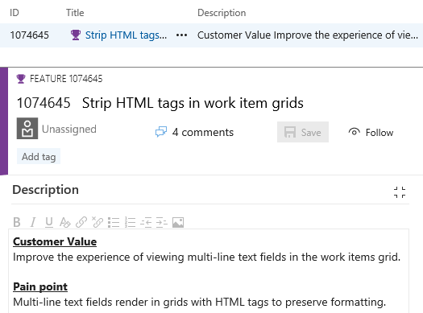

# Customizable work item rules – VSTS Sprint 122 Update

> [!NOTE]
> The features discussed in this post will be rolling out over the next three weeks.

## Work

### New queries experience

> **Preview feature**
>
> To use this capability you must have the **New Queries Experience** [preview feature](https://www.visualstudio.com/docs/collaborate/preview-features) enabled on your profile.

The Queries Hub has a new look and feel, changes in navigation, and some exciting new features like the ability to search for queries.

#### User Focused Navigation

When you enable the preview of the Queries Hub, you’ll notice that the left pane is gone. To navigate quickly between your favorite queries, use the dropdown in the query title.

Alternatively, browse all your personal and shared queries in the new directory pages and favorite what is important to you and your team. You can get to the query directory using the "Queries" breadcrumb.

In addition the directory pages highlight new metadata for each query including:

- The type of query
- The path within the hierarchy
- Who last modified it
- When it was last modified

#### Find queries faster with filtering

The query directory pages now include a filter bar that lets you quickly search for any query you care about.

#### Other improvements

Besides the big changes listed above, we have made:

- Create and edit followed work item queries with the @Follows macro
- Query for work items you were mentioned in with the @Mentions macro
- "Save as" now copies charts to the new query
- Simplified command bars for Results and Editor
- Expanded filter capabilities in the result grid

### Keyboard shortcuts in the work item form

Assign a work item to yourself (Alt + i), jump to discussion (Ctrl + Alt + d), and copy a quick link to the work item (Shift + Alt + c) using keyboard shortcuts. For the full list of new shortcuts, type "?" with a work item form open or see the table below.

### Strip HTML tags in work item grids

Based on customer feedback, we have updated the behavior of multi-line text fields in work item grids to remove HTML formatting. When added as a column to the grid, multi-line text fields will now display as plain text.

## Packaging

### Gulp, Yarn, and more support authenticated feeds

It's currently easy to work with authenticated npm feeds (in Package Management or external registries like npm Enterprise and Artifactory) if you're using the npm task, but more difficult if you're using a task runner like Gulp or an alternate npm client like Yarn. With this deployment, we've added a new 'npm Authenticate' build task that will add credentials to your .npmrc so that subsequent tasks can use authenticated feeds successfully.

### Package feed default permissions now include Project Administrators

Currently, creating a feed sets the creating user as the only feed owner, which can cause administration challenges in large organizations if that user switches teams or leaves the organization. To remove this single point of failure, creating a feed now uses the user's current project context to get the Project Administrators group and make it an owner of the feed as well. As with any permission, you can remove this group and further customize feed permissions using the feed settings dialog.

## Feedback

We would love to hear what you think about these features. Report a problem or provide a suggestion if you have ideas on things you’d like to see us prioritize through the new feedback menu.

You can also get advice and your questions answers by the community on [Stack Overflow](https://stackoverflow.com/questions/tagged/vs-team-services).

Thanks,

Aaron Bjork