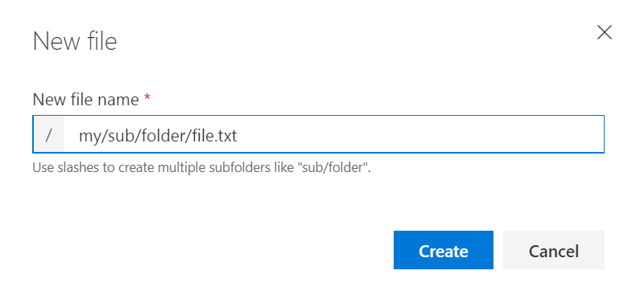
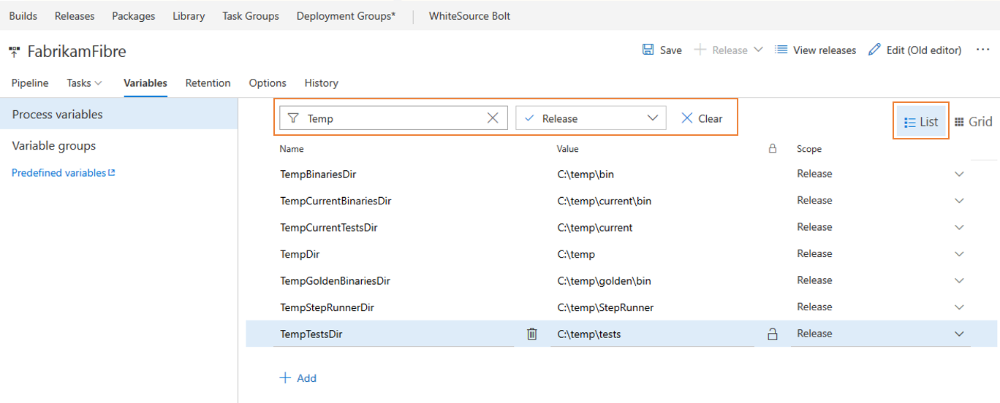
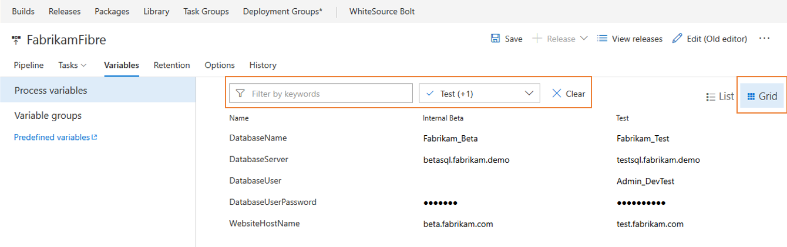
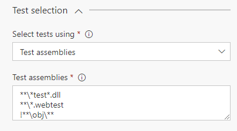
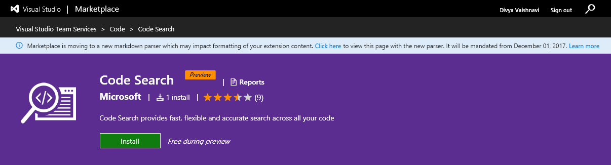

# Customizable work item rules – VSTS Sprint 122 Update

> [!NOTE]
> The features discussed in this post will be rolling out over the next three weeks.

## Work

### New queries experience

> [!TIP]
> To use this capability you must have the **New Queries Experience** [preview feature](https://www.visualstudio.com/docs/collaborate/preview-features) enabled on your profile.

The **Queries** hub has a new look and feel, changes in navigation, and some exciting new features such as the ability to search for queries.

#### User Focused Navigation

When you enable the preview of the Queries Hub, you’ll notice that the left pane is gone. To navigate quickly between your favorite queries, use the dropdown in the query title.

Alternatively, browse all your personal and shared queries in the new directory pages and favorite what is important to you and your team. You can get to the query directory using the "Queries" breadcrumb.

In addition the directory pages highlight new metadata for each query including:

- The type of query
- The path within the hierarchy
- Who last modified it
- When it was last modified

#### Find queries faster with filtering

The query directory pages now include a filter bar that lets you quickly search for any query you care about.

#### Other improvements

Besides the big changes listed above, we have made:

- Create and edit followed work item queries with the @Follows macro
- Query for work items you were mentioned in with the @Mentions macro
- "Save as" now copies charts to the new query
- Simplified command bars for Results and Editor
- Expanded filter capabilities in the result grid

### Keyboard shortcuts in the work item form

Assign a work item to yourself (Alt + i), jump to discussion (Ctrl + Alt + d), and copy a quick link to the work item (Shift + Alt + c) using keyboard shortcuts. For the full list of new shortcuts, type "?" with a work item form open or see the table below.

### Strip HTML tags in work item grids

Based on customer feedback, we have updated the behavior of multi-line text fields in work item grids to remove HTML formatting. When added as a column to the grid, multi-line text fields will now display as plain text.

## Code

### Create a folder in repository using web

You can now create folders via the web in your Git and TFVC repositories. This feature gap has long been filled by the [Folder Management extension](https://marketplace.visualstudio.com/items?itemName=ms-devlabs.FolderManagement) which will now undergo the process of deprecation.

To create a folder, click New > Folder in either the command bar or context menu:

For TFVC, you'll specify a folder name and then check it in. For Git, because empty folders aren't permitted, you'll also have to specify a file name, optionally edit the file, then commit it.

Additionally, for Git, The "New file" dialog has been enhanced to accept slashes to create subfolders:

## Build

### Multi-phase builds

Modern multi-tier apps often must be built with different sets of tasks, on different sets of agents with varying capabilities, sometimes even on different platforms. Until now, in VSTS you had to create a separate build for each aspect of these kinds of apps. Today we’re announcing availability of multi-phase builds.

You can configure each phase with the tasks you need, and specify a different agent queue for each phase. Each phase can run multiple jobs in parallel using multipliers. You can publish artifacts in one phase, and then download those artifacts to use them in a subsequent phase.

Some scenarios that are now possible include:

1. Compile your app on a build agent pool in the first phase, and then run tests on a test agent pool in the second phase.
1. Compile an ASP.NET Core back-end in the first phase on a Windows agent, and then compile the mobile front-end for your app on a macOS agent in the second phase.

When this feature reaches your account, you’ll notice that all your current build definitions have been upgraded to have a single phase. Some of the configuration options such as demands and multi-configuration will be moved to each phase. You can continue to select a default queue for all the phases in a build definition, and then optionally override that choice in each phase.

We’re still working on a few features:

- Ability to consume output variables from one phase in a subsequent phase.
- Ability to run phases in parallel. (For now, all the phases you define run sequentially).

## Release

### Personalized notifications for releases

Release notifications are now integrated with the VSTS notification settings experience. Users managing releases are now automatically notified of pending actions (approvals or manual interventions) on them and important deployment failures.
Users can turn off these notifications by navigating to the Notification settings under the profile menu and switching off Release Subscriptions. Users can also subscribe to additional notifications by creating custom subscriptions.
Admins can control subscriptions for teams and groups from the notification settings under team and account settings.

Release definition authors will then no longer have a control over whether to send emails for approvals and deployment completions.

This is especially useful for large accounts that have multiple stakeholders for releases, and users other than approver, release creator and environment owner might want to be notified.

This screenshot shows the default subscriptions for release notifications that are enabled for all users of the account.

[Learn more](https://blogs.msdn.microsoft.com/devops/2017/09/04/managing-release-notifications/)

### Manage variables using the List and Grid views in the new Release definition editor

Manage variables using the List and Grid views in the new Release definition editor
We have heard your feedback loud & clear that working with variables in the new Release definition editor was very painful.

We are excited to announce the ability to filter/search for variables to quickly scope down what you are looking for AND ability to compare variables across environments side-by-side.

You can now easily manage all your release and environment variables using the two views - List view and Grid view. Use the list view to quickly add release or environment variables and the grid view to compare and edit variables across scopes. Additionally, you can use the filter and keyword search to manage the set of variables to work with in both the views.

### Branch filters in environment triggers

In the new release definition editor you can now specify artifact conditions for a specific environment. You can add multiple filters for each artifact linked to the release definition. Deployment will be triggered to this environment only if all the artifact conditions are successfully met.

### Azure Resource Group task - Exposes deployment outputs as Task variables

Azure Resource Manager templates allow defining "outputs" which need to be returned after an Azure deployment. We have now enhanced our inbuilt VSTS Azure RG deploy task to expose the "output" JSON section of the deployment object as task output parameter with name: "<Task Reference name>.DeploymentOutputs".  Users can further parse the JSON object and access the individual output values which can be consumed in subsequent tasks of the release environment.

## Test

### Run webtests using the VSTest task

Using the Visual Studio test task, webtests can now be run in the CI/CD pipeline. Webtest can be run by specifying the tests to run in the task assembly input. Any test case work item that has an 'associated automation' linked to a webtest, can also be run by selecting the test plan/test suite in the task.

Webtest results will be available as an attachment to the test result. This can be downloaded for offline analysis in Visual Studio.

This capability is dependent on changes in the Visual Studio test platform and requires that Visual Studio 2017 Update 4 be installed on the build / release agent. Webtests cannot be run using prior versions of Visual Studio.

Similarly, webtests can be run using the 'Run Functional Test' task. This capability is dependent on changes in the Test Agent, that will be available with the Visual Studio 2017 Update 5.

### Chart widget for test plans and test suites

Until now, you could create charts for test plans and suites in Test hub and pin them to dashboard. We have now added a widget that enables creating charts for test plans and suites from the widget catalog on the dashboard. You can create charts for test authoring status or test execution status. Moreover, adding charts from the widget allows you to create larger charts when you have more data to be shown on a chart.

### Better console logs: preview improvements and support for different log types generated by Visual Studio Test task

We enhanced the VSTest task to publish logs generated by different kind of logging statements corresponding to standard output and standard error for failed tests. We have also improved the preview experience to support viewing text and log file formats, with capability to search in the log files.

## Package

### Gulp, Yarn, and more support authenticated feeds

It's currently easy to work with authenticated npm feeds (in Package Management or external registries like npm Enterprise and Artifactory) if you're using the npm task, but more difficult if you're using a task runner like Gulp or an alternate npm client like Yarn. With this deployment, we've added a new 'npm Authenticate' build task that will add credentials to your .npmrc so that subsequent tasks can use authenticated feeds successfully.

### Package feed default permissions now include Project Administrators

Currently, creating a feed sets the creating user as the only feed owner, which can cause administration challenges in large organizations if that user switches teams or leaves the organization. To remove this single point of failure, creating a feed now uses the user's current project context to get the Project Administrators group and make it an owner of the feed as well. As with any permission, you can remove this group and further customize feed permissions using the feed settings dialog.

## Reporting

The Burndown and Burnup Widgets are now available for those who have installed the [Analytics Extension](https://marketplace.visualstudio.com/items?itemName=ms.vss-analytics) on their Visual Studio Team Services (VSTS) accounts.

The Burndown widget lets you display a burndown across multiple teams and multiple sprints. You can use it to create a release burndown, a bug burndown, or a burndown on just about any scope of work over any time period. You can even create a burndown that spans team projects!

The Burndown widget helps you answer the question: Will we complete this project on time?

To help you answer that question, it provides these features:

- Displays percentage complete
- Computes average burndown
- Shows you when you have items not estimated with story points
- Tracks your scope increase over the course of the project
- Projects your project's completion date based on historical burndown and scope increase trends

You can burndown on any work item type based on count of work items or by the sum of a specific field (e.g.: Story Points). You can burndown using daily/weekly/monthly intervals or based on an iteration schedule. You can even add additional filter criteria to fine tune the exact scope of work you are burning down.
The widget is highly configurable allowing you use it for a wide variety of scenarios. We expect our customers will find amazing ways to use these two widgets.

The Burnup widget is just like the Burndown widget, except that it plots the work you have completed, rather than the work you have remaining.

## Login

### Refreshed error page and seamless tenant switching hint

Users who had an MSA and AAD identity with the same sign in address would receive a disambiguation prompt during login asking which identity they would like to sign in with. For many users, this choice was confusing because they either did not realize they had an MSA and an AAD identity or they we're unsure of which had access to the account. This new feature allows users to who have selected the incorrect identity when prompted to see an error page which indicates that their other identity actually had access and in the future to select the other identity and a button to sign in directly with the correct identity.

## Marketplace

### Marketplace moves to new markdown-it parser

Marketplace is now moving to new markdown-it parser which is based on the CommonMark specification. All new extensions created will use the new markdown-it parser. VSTS publishers of current extensions can test their markdown content using the 'try it' experience and can move to the new parser by making the manifest changes. Click here to [learn more](https://aka.ms/vsmarketplace_parser).

## Feedback

We would love to hear what you think about these features. Report a problem or provide a suggestion if you have ideas on things you’d like to see us prioritize through the new feedback menu.

You can also get advice and your questions answers by the community on [Stack Overflow](https://stackoverflow.com/questions/tagged/vs-team-services).

Thanks,

Aaron Bjork