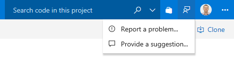

# The Azure DevOps Launch Update

In the Azure DevOps Launch Update, .

Check out the [Features](#features) list below for more.

## Features

.

## Next steps

> [!NOTE]
> These features will be rolling out over the next two to three weeks.

Read about the new features below and head over to Azure DevOps Services to try them for yourself.

> [!div class="nextstepaction"]
> [Go to Azure DevOps Services](http://go.microsoft.com/fwlink/?LinkId=307137&campaign=o~msft~docs~product-vsts~release-notes)

## Feedback

We would love to hear what you think about these features. Use the feedback menu to report a problem or provide a suggestion.

> [!div class="mx-imgBorder"]

You can also get advice and your questions answered by the community on [Stack Overflow](https://stackoverflow.com/questions/tagged/vsts).

Thanks,

Jeremy Epling