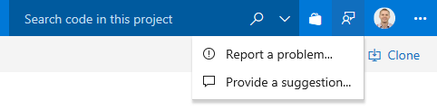

# TBD – VSTS Sprint 137 Update

TBD

## Next steps

> [!NOTE]
> These features will be rolling out over the next two to three weeks.

Read about the new features below and head over to VSTS to try them for yourself.

> [!div class="nextstepaction"]
> [Go to VSTS](http://go.microsoft.com/fwlink/?LinkId=307137&campaign=o~msft~docs~product-vsts~release-notes)

## Features

TBD

## Code

### Pull Requests no longer rely on team context

When we first launched the PR experience, we thought it would make sense to assign all PRs to the team context the user had selected when creating the PR.  This behavior has long been a frustration point, as many people did not notice the connection between the team context and the PR assignment.  In fact, this has been one of the top [User Voice tickets](https://visualstudio.uservoice.com/forums/330519-visual-studio-team-services/suggestions/18780553-dont-add-the-default-team-as-reviewer-when-doing-a) for some time.  ​
​
As part of the new navigation changes, we took the opportunity to change this default association with teams.  Users that have opted-in will notice two changes:​
​
1. When creating a PR, no reviewers are added by default. The reviewers list does have a feature to make it easier to add individuals and groups that have been added to PRs recently. The [required reviewers policy](https://docs.microsoft.com/en-us/vsts/git/branch-policies?view=vsts#automatically-include-code-reviewers) can also help teams that want to ensure that specific reviewers are added to review their code.​
2. The Pull Requests hub has a new customizable section.  By default, this section shows PRs "Assigned to my teams", providing equivalent functionality as the old section.  However, for users that belong to multiple teams, this section will show PRs assigned to all of their teams.  The section is also customizable - just click on the "Customize this view" action near the section header.

### New permissions to manage bypassing branch policies

There are many scenarios where users have the occasional need to bypass a branch policy - reverting a change that caused a build break, applying a hotfix in the middle of the night, etc.  Previously, we offered a permission (Exempt from policy enforcement) to help teams manage which users were granted the ability to bypass branch policies when completing a pull request.  However, that permission also granted the ability to push directly to the branch, bypassing the PR process entirely.​
​
To improve this experience, we've split the old permission to offer more control to teams that are granting bypass permissions.  There are two new permissions to replace the old one:​
​
1. **Bypass policies when completing pull requests.** Users with this permission will be able to opt-in to the "Override" experience for pull requests.
2. **Bypass policies when pushing.** Users with this permission will be able to push directly to branches that have required policies configured.​
​
By granting the first permission and denying the second, a user will be able to use the bypass option when necessary, but will still have the protection from accidentally pushing to a branch with policies.  ​
​
Note, this change does not introduce any behavior changes.  For example, users that were formerly granted Allow for "Exempt from policy enforcement" will be granted Allow for both new permissions, so they will be able to both override completion on PRs and push directly to branches with policies.

Learn more about the new permissions here: [TODO - Get link to docs]()

## Wiki

### Attach files and images from anywhere in a wiki repo

Now you can add attachments and images in any folder on a wiki repo and link those files and images in a wiki page using the existing linking syntax.

> [!div class="mx-imgBorder"]

### Anchor links

Now you can simply click on a section heading in a wiki page and generate URL for the anchor link on the page.

> [!div class="mx-imgBorder"]

### View broken links

All links in a wiki that are not linked to a wiki page will appear in a distinct red color giving you a visual clue regarding all broken links in a wiki page.

> [!div class="mx-imgBorder"]

### Open page in new tab

Now you can right click on a wiki page and open it in new tab or simply press CTRL + left click on a wiki page to open it in a new tab.

> [!div class="mx-imgBorder"]

## Build and Release

### General availability of Microsoft-hosted Linux and macOS agents for CI/CD

The Microsoft-hosted Linux and macOS agents are not generally available.

## Package

### Package Management now built in to all VSTS accounts

The Package Management extension is now built into all accounts. If you're using the new navigation preview, look for the pink stack of packages just below the test tube. If you're still on the current navigation, look for the Packages hub in the Build & Release hub group. Each VSTS account comes with 5 free Package Management users, and additional users can be purchased from [the Marketplace](https://marketplace.visualstudio.com/items?itemName=ms.feed).

## Administration

### Connect or disconnect AAD as a PCA

A project collection administrator (PCA) can now [connect or disconnect their account from Azure Active Directory](/vsts/organizations/accounts/connect-account-to-aad?view=vsts), where previously you had to be the account owner. 

### Set up or remove billing as a PCA

In order to [set up billing](/vsts/billing/set-up-billing-for-your-organization-vs?view=vsts) and link an account to an Azure subscription you previously needed to be the account owner.  In addition, if your account was linked to an Azure subscription that you couldn’t access, the only way to get it removed was to call support. Now a PCA can set up or remove billing.

## Feedback

We would love to hear what you think about these features. Use the feedback menu to report a problem or provide a suggestion.

> [!div class="mx-imgBorder"]

You can also get advice and your questions answered by the community on [Stack Overflow](https://stackoverflow.com/questions/tagged/vsts).

Thanks,

TBD
