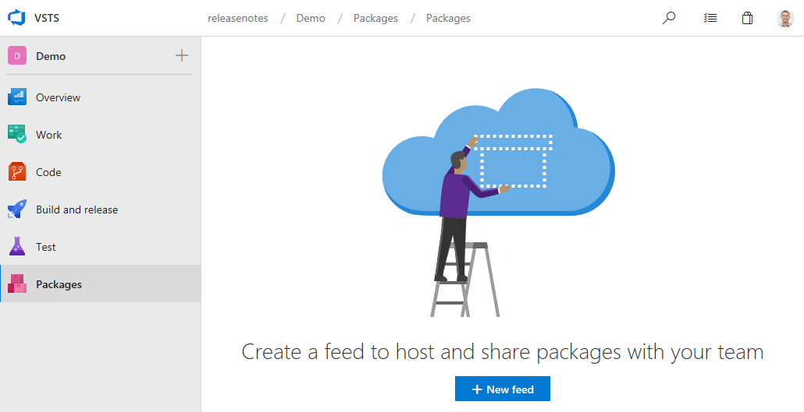

# Microsoft-hosted Linux and macOS agents generally available – VSTS Sprint 137 Update

In the **Sprint 137 Update** of Visual Studio Team Services (VSTS), we remove the "Preview" moniker from our Linux and macOS Microsoft-hosted CI/CD agents and [make them generally available](#build-and-release-with-microsoft-hosted-linux-and-macos-agents). Along with our Microsoft-hosted Windows agent, you now have a trusted and scalable platform for production builds and releases, no matter what your platform.

There are a number of other features across Code, Wiki, Package, and Administration. Check out the [Features](#features) list below for more.

## Next steps

> [!NOTE]
> These features will be rolling out over the next two to three weeks.

Read about the new features below and head over to VSTS to try them for yourself.

> [!div class="nextstepaction"]
> [Go to VSTS](http://go.microsoft.com/fwlink/?LinkId=307137&campaign=o~msft~docs~product-vsts~release-notes)

## Features

Code:

- [Create pull requests without a default team as reviewer](#create-pull-requests-without-a-default-team-as-reviewer)
- [Allow bypassing branch policies without giving up push protection](#allow-bypassing-branch-policies-without-giving-up-push-protection)

Wiki:

- [Attach files and images from anywhere in a wiki repository](#attach-files-and-images-from-anywhere-in-a-wiki-repository)
- [Link to headings within a page](#link-to-headings-within-a-page)
- [View broken links](#view-broken-links)
- [Open page in new tab](#open-page-in-new-tab)

Build and release:

- [Build and release with Microsoft-hosted Linux and macOS agents](#build-and-release-with-microsoft-hosted-linux-and-macos-agents)
- [Automatically deploy to new targets in a deployment group](#automatically-deploy-to-new-targets-in-a-deployment-group)

Package:

- [Get started with pre-installed Package Management](#get-started-with-pre-installed-package-management)

Admin:

- [Connect or disconnect Azure Active Directory as a Project Collection Admin](#connect-or-disconnect-azure-active-directory-as-a-project-collection-admin)
- [Set up or remove billing as a Project Collection Admin](#set-up-or-remove-billing-as-a-project-collection-admin)

## Code

### Create pull requests without a default team as reviewer

> [!IMPORTANT]
> To use this capability, you must have the **New Navigation** [preview feature](/vsts/project/navigation/preview-features) enabled on your profile or account.

When we first launched the pull request (PR) experience, we thought it would make sense to assign all PRs to the team context that you had selected when creating the PR. This behavior has been a frustration point, since many people did not notice the connection between the team context and the PR assignment. In fact, this has been one of our top [UserVoice suggestions](https://visualstudio.uservoice.com/forums/330519-visual-studio-team-services/suggestions/18780553-dont-add-the-default-team-as-reviewer-when-doing-a).
​
As part of the [new navigation](/vsts/release-notes/2018/jun-19-vsts#preview-our-new-navigation) changes, we took the opportunity to change this default association with teams. You'll notice two changes:​
​
1. When creating a PR, no reviewers will be added by default. The reviewers list does have a feature to make it easier to add individuals and groups that have been added to PRs recently. The [required reviewers policy](/vsts/git/branch-policies?view=vsts#automatically-include-code-reviewers) can also help teams that want to ensure that specific reviewers are added to review their code.​
2. The **Pull Requests** hub has a new customizable section. By default, this section shows PRs "Assigned to my teams", providing equivalent functionality as the old section. However, if you belong to multiple teams, this section will show PRs assigned to any of your teams. The section is also customizable - just click on the "Customize this view" action near the section header.

### Allow bypassing branch policies without giving up push protection

There are many scenarios where you have the occasional need to bypass a branch policy - reverting a change that caused a build break, applying a hotfix in the middle of the night, etc. Previously, we offered a permission ("Exempt from policy enforcement") to help teams manage which users were granted the ability to bypass branch policies when completing a pull request. However, that permission also granted the ability to push directly to the branch, bypassing the PR process entirely.​
​
To improve this experience, we've split the old permission to offer more control to teams that are granting bypass permissions. There are two new permissions to replace the old one:​
​
1. **Bypass policies when completing pull requests.** Users with this permission will be able to use the "Override" experience for pull requests.
2. **Bypass policies when pushing.** Users with this permission will be able to push directly to branches that have required policies configured.​
​
By granting the first permission and denying the second, a user will be able to use the bypass option when necessary, but will still have the protection from accidentally pushing to a branch with policies.
​
> [!NOTE]
> This change does not introduce any behavior changes. Users that were formerly granted **Allow** for "Exempt from policy enforcement" will be granted **Allow** for both new permissions, so they will be able to both override completion on PRs and push directly to branches with policies.

See the [Set branch permissions](/vsts/git/branch-permissions?view=vsts) documentation for more information.

## Wiki

### Attach files and images from anywhere in a wiki repository

Now you can add attachments and images in any folder on a wiki repo and link to them in a wiki page using the existing linking syntax.

> [!div class="mx-imgBorder"]

### Link to headings within a page

Now you can simply click on a section heading in a wiki page to generate a URL for the anchor link on the page.

> [!div class="mx-imgBorder"]

### View broken links

All links in a wiki that are not linked to a wiki page will appear in a distinct red color and broken link icon, giving you a visual clue regarding all broken links in a wiki page.

> [!div class="mx-imgBorder"]

### Open page in new tab

Now you can right click on a wiki page and open it in new tab or simply press CTRL + left click on a wiki page to open it in a new tab.

> [!div class="mx-imgBorder"]

## Build and Release

### Build and release with Microsoft-hosted Linux and macOS agents

The Microsoft-hosted Linux and macOS agents are now out of preview and generally available. After several months in preview, listening to feedback, and tuning the infrastructure to provide a consistent service, we're excited to offer these now in GA. See the [Microsoft-hosted agents](/vsts/pipelines/agents/hosted?view=vsts) documentation for more information.

### Automatically deploy to new targets in a deployment group

Previously, when new targets were added to a deployment group, a manual deployment was required to ensure all targets have the same release. You can now configure the environment to automatically deploy the last successful release to the new targets. We plan to add additional trigger events and actions to the auto redeploy configuration in coming sprints. See the [Deployment Groups](/vsts/pipelines/release/deployment-groups/) documentation for more information.

> [!div class="mx-imgBorder"]

## Package

### Get started with pre-installed Package Management

The Package Management extension is pre-installed into all accounts. If you're using the new navigation preview, look for the pink stack of packages just below the test tube. If you're still on the current navigation, look for the **Packages** hub in the **Build and release** hub group. Each account comes with 5 free Package Management users, and additional users can be purchased from [the Marketplace](https://marketplace.visualstudio.com/items?itemName=ms.feed). Manage extensions using the menu in the top-right of the navigation.

> [!div class="mx-imgBorder"]

## Administration

### Connect or disconnect Azure Active Directory as a Project Collection Admin

A Project Collection Administrator (PCA) can now [connect or disconnect their account from Azure Active Directory](/vsts/organizations/accounts/connect-account-to-aad?view=vsts). Previously this had to be done by an account owner.

### Set up or remove billing as a Project Collection Admin

In order to [set up billing](/vsts/billing/set-up-billing-for-your-organization-vs?view=vsts) and link an account to an Azure subscription you previously needed to be the account owner. Plus, if your account was linked to an Azure subscription that you couldn’t access, the only way to get it removed was to call support. Now a Project Collection Administrator (PCA) can set up or remove billing.

## Feedback

We would love to hear what you think about these features. Use the feedback menu to report a problem or provide a suggestion.

> [!div class="mx-imgBorder"]

You can also get advice and your questions answered by the community on [Stack Overflow](https://stackoverflow.com/questions/tagged/vsts).

Thanks,

Biju Venugopal
